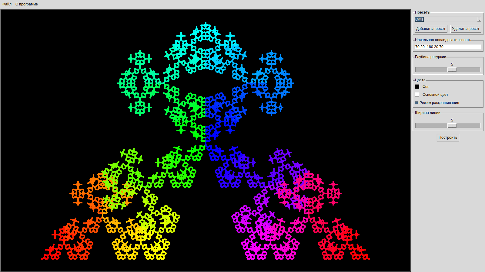

## [(Читать по-русски)](README.ru.md)

# Fractal Plotter

## Description

Fractal Plotter is a small crossplatform Tk-based gui python application, that
plots Koch curves and provides some options.

Koch curves is a simple fractals, which each segment iterates the base structure
of whole curve.

## Usage

Just [download]
(https://gitlab.com/bergentroll/fractal-plotter/repository/archive.tar.gz)
and unpack the contents of the repository and start [fractal-plotter.py]
(fractal-plotter.py). You need only [Python 3](https://www.python.org/downloads)
to be installed. Application uses it's standard library.

If you want to export your curves to png image files, you also need the
[ghostscript](http://ghostscript.com), but I am not shure how it works on
non-GNU/Linux systems.

Base of curve shape is a sequence of angles, that defines turns of segments.
To understand the algorythm you could select the "Default Koch Curve" preset
and plot some curves increasing the deep of recursion every time.
